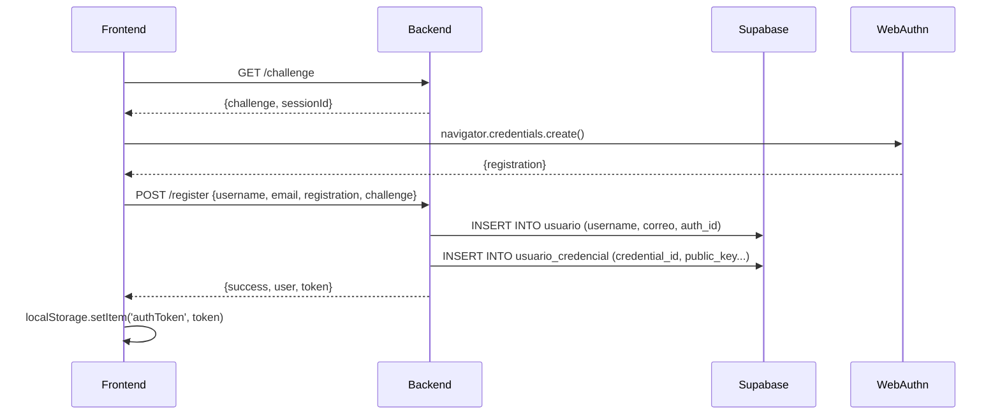
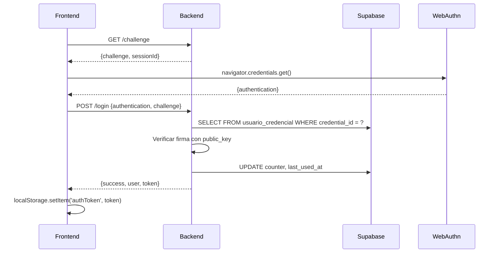

# 🚀 Integración Frontend - WebAuthn Backend

## 📋 Resumen

Este documento explica cómo conectar tu frontend (React/Vite) con el backend NestJS para autenticación con passkeys (WebAuthn).

---

## 🔗 Endpoints del Backend

**Base URL:** `http://localhost:3000/api/auth`

### 1️⃣ Obtener Challenge (Obligatorio antes de registro/login)

```http
GET /api/auth/challenge
```

**Response:**
```json
{
  "challenge": "random_base64_string",
  "sessionId": "session_xyz123"
}
```

---

### 2️⃣ Registrar Usuario Nuevo

```http
POST /api/auth/register
Content-Type: application/json
```

**Request Body:**
```json
{
  "username": "juanperez",
  "email": "juan@example.com",
  "registration": {
    // Objeto completo de navigator.credentials.create()
    "id": "credential_id_from_webauthn",
    "rawId": "base64_raw_id",
    "response": {
      "clientDataJSON": "base64_client_data",
      "attestationObject": "base64_attestation"
    },
    "type": "public-key",
    "transports": ["internal", "usb"]
  },
  "challenge": "challenge_recibido_del_endpoint_anterior"
}
```

**Response Success (201):**
```json
{
  "success": true,
  "user": {
    "id": "user_1703012345_abc123",
    "username": "juanperez",
    "email": "juan@example.com"
  },
  "token": "eyJhbGciOiJIUzI1NiIsInR5cCI6IkpXVCJ9...",
  "message": "Usuario registrado exitosamente"
}
```

**Lo que guarda el backend:**
- ✅ En tabla `usuario`: username, email, auth_id (generado), rol='GENERAL'
- ✅ En tabla `usuario_credencial`: credential_id, public_key, algorithm, counter, transports

---

### 3️⃣ Login con Passkey

```http
POST /api/auth/login
Content-Type: application/json
```

**Request Body:**
```json
{
  "authentication": {
    // Objeto completo de navigator.credentials.get()
    "id": "credential_id_existente",
    "rawId": "base64_raw_id",
    "response": {
      "clientDataJSON": "base64_client_data",
      "authenticatorData": "base64_authenticator_data",
      "signature": "base64_signature",
      "userHandle": "base64_user_handle"
    },
    "type": "public-key"
  },
  "challenge": "challenge_recibido_del_endpoint_anterior"
}
```

**Response Success (200):**
```json
{
  "success": true,
  "user": {
    "id": "user_1703012345_abc123",
    "username": "juanperez",
    "email": "juan@example.com"
  },
  "token": "eyJhbGciOiJIUzI1NiIsInR5cCI6IkpXVCJ9...",
  "message": "Login exitoso"
}
```

---

## 💻 Código Frontend (React + TypeScript)

### 1. Instalar dependencias

```bash
npm install @passwordless-id/webauthn
```

### 2. Crear servicio de autenticación

```typescript
// src/services/authService.ts
import { client } from '@passwordless-id/webauthn';

const API_URL = 'http://localhost:3000/api/auth';

interface ChallengeResponse {
  challenge: string;
  sessionId: string;
}

interface AuthResponse {
  success: boolean;
  user: {
    id: string;
    username: string;
    email: string;
  };
  token: string;
  message: string;
}

export class AuthService {
  
  /**
   * 1. Obtener challenge del servidor
   */
  static async getChallenge(): Promise<ChallengeResponse> {
    const response = await fetch(`${API_URL}/challenge`, {
      method: 'GET',
    });
    
    if (!response.ok) {
      throw new Error('Error al obtener challenge');
    }
    
    return response.json();
  }

  /**
   * 2. Registrar nuevo usuario con passkey
   */
  static async register(username: string, email?: string): Promise<AuthResponse> {
    try {
      // Paso 1: Obtener challenge
      const { challenge } = await this.getChallenge();
      
      // Paso 2: Crear credencial WebAuthn
      const registration = await client.register(username, challenge, {
        authenticatorType: 'auto', // 'platform' para biométrica, 'roaming' para USB
        userVerification: 'required',
        timeout: 60000,
        attestation: false,
        debug: false,
      });

      console.log('✅ Credencial WebAuthn creada:', registration);

      // Paso 3: Enviar al backend
      const response = await fetch(`${API_URL}/register`, {
        method: 'POST',
        headers: {
          'Content-Type': 'application/json',
        },
        body: JSON.stringify({
          username,
          email,
          registration,
          challenge,
        }),
      });

      if (!response.ok) {
        const error = await response.json();
        throw new Error(error.message || 'Error al registrar usuario');
      }

      const data: AuthResponse = await response.json();
      
      // Guardar token en localStorage
      localStorage.setItem('authToken', data.token);
      localStorage.setItem('user', JSON.stringify(data.user));

      return data;
      
    } catch (error) {
      console.error('❌ Error en registro:', error);
      throw error;
    }
  }

  /**
   * 3. Login con passkey existente
   */
  static async login(): Promise<AuthResponse> {
    try {
      // Paso 1: Obtener challenge
      const { challenge } = await this.getChallenge();
      
      // Paso 2: Solicitar autenticación WebAuthn
      const authentication = await client.authenticate([], challenge, {
        authenticatorType: 'auto',
        userVerification: 'required',
        timeout: 60000,
        debug: false,
      });

      console.log('✅ Autenticación WebAuthn completada:', authentication);

      // Paso 3: Enviar al backend
      const response = await fetch(`${API_URL}/login`, {
        method: 'POST',
        headers: {
          'Content-Type': 'application/json',
        },
        body: JSON.stringify({
          authentication,
          challenge,
        }),
      });

      if (!response.ok) {
        const error = await response.json();
        throw new Error(error.message || 'Error al autenticar');
      }

      const data: AuthResponse = await response.json();
      
      // Guardar token en localStorage
      localStorage.setItem('authToken', data.token);
      localStorage.setItem('user', JSON.stringify(data.user));

      return data;
      
    } catch (error) {
      console.error('❌ Error en login:', error);
      throw error;
    }
  }

  /**
   * 4. Logout
   */
  static logout(): void {
    localStorage.removeItem('authToken');
    localStorage.removeItem('user');
  }

  /**
   * 5. Obtener usuario actual
   */
  static getCurrentUser(): any | null {
    const userStr = localStorage.getItem('user');
    return userStr ? JSON.parse(userStr) : null;
  }

  /**
   * 6. Verificar si está autenticado
   */
  static isAuthenticated(): boolean {
    return !!localStorage.getItem('authToken');
  }

  /**
   * 7. Obtener token JWT
   */
  static getToken(): string | null {
    return localStorage.getItem('authToken');
  }
}
```

---

### 3. Componente de Registro

```tsx
// src/components/RegisterForm.tsx
import { useState } from 'react';
import { AuthService } from '../services/authService';

export function RegisterForm() {
  const [username, setUsername] = useState('');
  const [email, setEmail] = useState('');
  const [loading, setLoading] = useState(false);
  const [error, setError] = useState('');

  const handleRegister = async (e: React.FormEvent) => {
    e.preventDefault();
    setLoading(true);
    setError('');

    try {
      const result = await AuthService.register(username, email);
      console.log('✅ Usuario registrado:', result);
      
      // Redirigir o actualizar UI
      alert(`¡Bienvenido ${result.user.username}! Tu cuenta ha sido creada.`);
      
    } catch (err) {
      setError((err as Error).message);
      console.error('❌ Error:', err);
    } finally {
      setLoading(false);
    }
  };

  return (
    <div className="register-form">
      <h2>Crear Cuenta con Passkey</h2>
      
      <form onSubmit={handleRegister}>
        <div>
          <label>Usuario:</label>
          <input
            type="text"
            value={username}
            onChange={(e) => setUsername(e.target.value)}
            placeholder="juanperez"
            required
            minLength={3}
          />
        </div>

        <div>
          <label>Email (opcional):</label>
          <input
            type="email"
            value={email}
            onChange={(e) => setEmail(e.target.value)}
            placeholder="juan@example.com"
          />
        </div>

        {error && <div className="error">{error}</div>}

        <button type="submit" disabled={loading}>
          {loading ? 'Creando cuenta...' : '🔐 Crear cuenta con biométrica'}
        </button>
      </form>

      <p className="info">
        Se te pedirá usar tu huella digital, Face ID o PIN del dispositivo
      </p>
    </div>
  );
}
```

---

### 4. Componente de Login

```tsx
// src/components/LoginForm.tsx
import { useState } from 'react';
import { AuthService } from '../services/authService';

export function LoginForm() {
  const [loading, setLoading] = useState(false);
  const [error, setError] = useState('');

  const handleLogin = async () => {
    setLoading(true);
    setError('');

    try {
      const result = await AuthService.login();
      console.log('✅ Login exitoso:', result);
      
      // Redirigir o actualizar UI
      alert(`¡Bienvenido de vuelta ${result.user.username}!`);
      
    } catch (err) {
      setError((err as Error).message);
      console.error('❌ Error:', err);
    } finally {
      setLoading(false);
    }
  };

  return (
    <div className="login-form">
      <h2>Iniciar Sesión</h2>
      
      {error && <div className="error">{error}</div>}

      <button onClick={handleLogin} disabled={loading}>
        {loading ? 'Verificando...' : '🔐 Iniciar sesión con biométrica'}
      </button>

      <p className="info">
        Usa tu huella digital, Face ID o PIN para acceder
      </p>
    </div>
  );
}
```

---

### 5. Hook para requests autenticados

```typescript
// src/hooks/useAuthFetch.ts
import { AuthService } from '../services/authService';

export function useAuthFetch() {
  
  const authFetch = async (url: string, options: RequestInit = {}) => {
    const token = AuthService.getToken();
    
    if (!token) {
      throw new Error('No estás autenticado');
    }

    const response = await fetch(url, {
      ...options,
      headers: {
        ...options.headers,
        'Authorization': `Bearer ${token}`,
        'Content-Type': 'application/json',
      },
    });

    if (response.status === 401) {
      // Token expirado o inválido
      AuthService.logout();
      throw new Error('Sesión expirada. Por favor inicia sesión de nuevo.');
    }

    return response;
  };

  return { authFetch };
}
```

---

## 🔍 Flujo Completo

### Registro (Sign Up)


### Login


---

## ⚙️ Configuración CORS

El backend ya tiene CORS habilitado para `http://localhost:5173` (Vite default).

Si usas otro puerto, actualiza en `src/main.ts`:

```typescript
app.enableCors({
  origin: 'http://localhost:TU_PUERTO',
  credentials: true,
});
```

---

## 🧪 Testing

### 1. Probar Supabase
```bash
curl http://localhost:3000/api/auth/test-supabase
```

### 2. Obtener Challenge
```bash
curl http://localhost:3000/api/auth/challenge
```

### 3. Verificar token JWT
```bash
curl -H "Authorization: Bearer YOUR_TOKEN" http://localhost:3000/api/protected
```

---

## 📊 Base de Datos

### Tabla `usuario`
```sql
- id (bigint)
- username (text) ← UNICO, usado para login
- correo (text) ← email del usuario
- auth_id (text) ← ID generado automáticamente
- nombre (text)
- rol (rol_usuario) ← DEFAULT 'GENERAL'
- created_at (timestamp)
```

### Tabla `usuario_credencial`
```sql
- id (bigint)
- usuario_id (bigint) ← FK a usuario.id
- credential_id (text) ← UNICO, ID de la passkey
- public_key (text) ← Clave pública para verificar firmas
- algorithm (text) ← 'ES256'
- counter (integer) ← Incrementa en cada login
- transports (text[]) ← ['internal', 'usb', etc]
- created_at (timestamp)
- last_used_at (timestamp) ← Se actualiza en cada login
```

---

## 🚨 Errores Comunes

### 1. "Challenge inválido o expirado"
- **Causa:** El challenge expira en 5 minutos
- **Solución:** Solicita un nuevo challenge antes de cada registro/login

### 2. "Credencial no encontrada"
- **Causa:** Intentas hacer login sin haberte registrado
- **Solución:** Registra primero con el mismo dispositivo/navegador

### 3. "CORS error"
- **Causa:** Frontend en puerto diferente a 5173
- **Solución:** Actualiza la configuración en `main.ts`

### 4. "WebAuthn not supported"
- **Causa:** Navegador antiguo o sin HTTPS (en producción)
- **Solución:** Usa Chrome/Edge/Safari modernos. En localhost funciona sin HTTPS.

---

## 🔐 Seguridad

- ✅ **JWT expira en 7 días** (configurable en `auth.module.ts`)
- ✅ **Challenge expira en 5 minutos**
- ✅ **Counter anti-replay** previene ataques de repetición
- ✅ **Credenciales vinculadas al dominio** (resistente a phishing)
- ✅ **Sin contraseñas** almacenadas en base de datos

---

## 📱 Compatibilidad

**Funciona en:**
- ✅ Chrome/Edge/Brave (Windows Hello, Android biométrica)
- ✅ Safari (Touch ID, Face ID en Mac/iOS)
- ✅ Firefox (Windows Hello, Android)
- ✅ Cualquier navegador con WebAuthn support

**Requiere:**
- HTTPS en producción (localhost funciona sin SSL)
- Dispositivo con biométrica O PIN/contraseña del sistema

---

## 🎯 Próximos Pasos

1. ✅ Copia el código del servicio `authService.ts`
2. ✅ Implementa los componentes de registro y login
3. ✅ Configura las variables de entorno en backend (.env)
4. ✅ Ejecuta el SQL en Supabase para crear `usuario_credencial`
5. ✅ Inicia el backend: `npm run start:dev`
6. ✅ Prueba el registro con tu huella digital/Face ID
7. ✅ Prueba el login con la misma credencial

---

## 📞 Endpoints Disponibles

| Método | Ruta | Descripción |
|--------|------|-------------|
| GET | `/api/auth/challenge` | Obtener challenge |
| POST | `/api/auth/register` | Registrar nuevo usuario |
| POST | `/api/auth/login` | Login con passkey |
| GET | `/api/auth/test-supabase` | Verificar conexión DB |

---

**¡Listo para copiar y pegar! 🚀**
