```mermaid
erDiagram
    %% =====================================================
    %% R3Foresta - BD Oficial (vFinal + Módulo Plantación)
    %% Postgres/Supabase aligned
    %% =====================================================

    USUARIO {
        bigint id PK
        string userid "handle visible: andy, pablex, etc."
        string nombre
        string doc_identidad "UNIQUE, opcional"
        string wallet_address "UNIQUE, opcional; formato: 0x + 40 hex"
        string organizacion "texto (si luego es catálogo se migra)"
        string contacto "opcional; formato: +########"
        string rol "DEFAULT=GENERAL; {RECOLECTOR|VIVERO|VOLUNTARIO|GENERAL}"
        datetime created_at
    }

    UBICACION {
        bigint id PK
        string pais
        string departamento
        string provincia
        string comunidad
        string zona
        decimal latitud "OBLIGATORIO [-90..90] (6 decimales)"
        decimal longitud "OBLIGATORIO [-180..180] (6 decimales)"
        datetime created_at
    }

    VIVERO {
        bigint id PK
        string codigo "UNIQUE; ej: VIV-001 (autogenerado)"
        string nombre "UNIQUE (case-insensitive)"
        bigint ubicacion_id FK "UNIQUE (1:1 con UBICACION)"
        datetime created_at
    }

    PLANTA {
        bigint id PK
        string especie
        string nombre_cientifico
        string variedad
        string tipo_planta "Árbol/Arbusto/.../Otro"
        string tipo_planta_otro "OBLIGATORIO si tipo_planta=Otro"
        string fuente "tipo_material_origen {SEMILLA|ESQUEJE}"
        datetime created_at
    }

    METODO_RECOLECCION {
        bigint id PK
        string nombre "UNIQUE (case-insensitive)"
        string descripcion
    }

    RECOLECCION {
        bigint id PK
        string codigo_trazabilidad "UNIQUE; REC-YYYY-XXXXX"
        date fecha "OBLIGATORIO; [hoy-45d .. hoy]"
        string nombre_cientifico "si no hay planta_id"
        string nombre_comercial "si no hay planta_id"
        decimal cantidad "OBLIGATORIO > 0"
        string unidad "UNIDAD/UNIDADES para ESQUEJE; KG/G para SEMILLA"
        string tipo_material "tipo_material_origen {SEMILLA|ESQUEJE}"
        string estado "DEFAULT=ALMACENADO; {USADO|ALMACENADO|DESECHADO}"
        boolean especie_nueva "DEFAULT=false"
        string observaciones "max 1000 chars"
        bigint usuario_id FK
        bigint ubicacion_id FK
        bigint vivero_id FK "opcional"
        bigint metodo_id FK
        bigint planta_id FK "opcional (si no existe en catálogo)"
        datetime created_at
    }

    RECOLECCION_FOTO {
        bigint id PK
        bigint recoleccion_id FK
        string url
        int peso_bytes "max 5MB"
        string formato "JPG/JPEG/PNG"
        datetime created_at
        %% Regla negocio: mínimo 2 fotos por recolección (validar en backend)
    }

    %% =========================================
    %% FASE VIVERO (antes: LOTE_PLANTACION)
    %% =========================================
    LOTE_FASE_VIVERO {
        bigint id PK
        string codigo_trazabilidad "UNIQUE; LFV-YYYY-XXXXX"
        bigint planta_id FK
        bigint vivero_id FK
        bigint responsable_id FK "creador/responsable"
        date fecha_inicio
        int cantidad_inicio
        int cantidad_embolsadas "DEFAULT=0"
        int cantidad_sombra "DEFAULT=0"
        int cantidad_lista_plantar "DEFAULT=0"
        date fecha_embolsado
        date fecha_sombra
        date fecha_salida
        decimal altura_prom_sombra
        decimal altura_prom_salida
        string estado "DEFAULT=INICIO; {INICIO|EMBOLSADO|SOMBRA|LISTA_PLANTAR|SALIDA_VIVERO}"
        datetime created_at
        datetime updated_at
        bigint updated_by FK "obligatorio en UPDATE (para historial)"
    }

    LOTE_FASE_VIVERO_RECOLECCION {
        bigint lote_id PK, FK
        bigint recoleccion_id PK, FK
        %% PK compuesta (lote_id, recoleccion_id)
    }

    LOTE_FASE_VIVERO_HISTORIAL {
        bigint id PK
        bigint lote_id FK
        int nro_cambio "UNIQUE por lote (lote_id, nro_cambio)"
        datetime fecha_cambio "DEFAULT=now()"
        bigint responsable_id FK
        string accion "{INICIO|EMBOLSADO|SOMBRA|LISTA_PLANTAR|SALIDA|AJUSTE}"
        string estado "{INICIO|EMBOLSADO|SOMBRA|LISTA_PLANTAR|SALIDA_VIVERO}"

        int cantidad_inicio
        int cantidad_embolsadas
        int cantidad_sombra
        int cantidad_lista_plantar

        date fecha_inicio
        date fecha_embolsado
        date fecha_sombra
        date fecha_salida

        decimal altura_prom_sombra
        decimal altura_prom_salida

        string notas "max 2000 chars"
        %% Se llena automáticamente en INSERT/UPDATE del LOTE_FASE_VIVERO (triggers)
    }

    LOTE_FASE_VIVERO_FOTO {
        bigint id PK
        bigint lote_historial_id FK
        string url
        int peso_bytes "max 5MB (regla de negocio)"
        string formato "JPG/JPEG/PNG"
        boolean es_portada "TRUE si es la foto principal de ese cambio"
        string descripcion "ej: detalle de raíces, vista general"
        datetime created_at
    }

    LOTE_FASE_VIVERO_HISTORIAL ||--o{ LOTE_FASE_VIVERO_FOTO : tiene_fotos

    %% =========================================
    %% MÓDULO PLANTACIÓN (campo)
    %% =========================================

    TIPO_RIEGO {
        bigint id PK
        string nombre "UNIQUE; Botellas recicladas / Goteo / Natural / Inundación"
        string descripcion
    }

    TIPO_ABONO {
        bigint id PK
        string nombre "UNIQUE; Humus / Tierra negra / Compost / etc."
        string descripcion
    }

    PLANTACION {
        bigint id PK
        string codigo_trazabilidad "UNIQUE; PLA-YYYY-XXXXX"
        string destino "{ARBORIZACION|FORESTACION|REFORESTACION}"
        bigint ubicacion_id FK "dónde se plantó (campo)"

        int cantidad_arboles "OBLIGATORIO > 0"
        date fecha_plantacion "OBLIGATORIO"

        decimal superficie_m2 "opcional: área de la plantación"

        decimal tamano_promedio_cm "tamaño promedio al plantar/monitoreo base"
        string propietario "nombre del dueño del terreno"
        string origen_propiedad "{DONADO|ADQUIRIDO|OTRO|NULL}"
        int frecuencia_monitoreo_dias "cada cuánto se monitorea"

        bigint created_by FK "USUARIO que registra la plantación"
        datetime created_at
    }

    PLANTACION_USUARIO {
        bigint plantacion_id PK, FK
        bigint usuario_id PK, FK
        string rol "RESPONSABLE / VOLUNTARIO / TECNICO / etc."
    }

    PLANTACION_LOTE_FASE_VIVERO {
        bigint plantacion_id PK, FK
        bigint lote_fase_vivero_id PK, FK
        int cantidad_plantines_usados "OBLIGATORIO > 0"
        %% permite que una plantación use varios lotes de vivero
    }

    PLANTACION_RIEGO {
        bigint plantacion_id PK, FK
        bigint tipo_riego_id PK, FK
        %% relación N:M entre PLANTACION y TIPO_RIEGO
    }

    PLANTACION_ABONO {
        bigint plantacion_id PK, FK
        bigint tipo_abono_id PK, FK
        %% relación N:M entre PLANTACION y TIPO_ABONO
    }

    PLANTACION_FOTO {
        bigint id PK
        bigint plantacion_id FK
        string url
        int peso_bytes
        string formato "JPG/JPEG/PNG"
        string descripcion
        datetime created_at
    }

    PLANTACION_MONITOREO {
        bigint id PK
        bigint plantacion_id FK
        date fecha_monitoreo
        int arboles_vivos
        int arboles_muertos
        int arboles_reemplazados
        string notas
        bigint usuario_id FK "quién monitorea"
        datetime created_at
    }

    %% =====================================================
    %% Relaciones
    %% =====================================================

    UBICACION ||--o{ VIVERO : tiene
    UBICACION ||--o{ RECOLECCION : ocurre_en
    UBICACION ||--o{ PLANTACION : se_ubica_en

    USUARIO ||--o{ RECOLECCION : recolecta
    USUARIO ||--o{ LOTE_FASE_VIVERO : crea
    USUARIO ||--o{ LOTE_FASE_VIVERO_HISTORIAL : registra
    USUARIO ||--o{ LOTE_FASE_VIVERO : actualiza "via updated_by"
    USUARIO ||--o{ PLANTACION : registra
    USUARIO ||--o{ PLANTACION_USUARIO : participa
    USUARIO ||--o{ PLANTACION_MONITOREO : monitorea

    VIVERO ||--o{ RECOLECCION : almacena
    VIVERO ||--o{ LOTE_FASE_VIVERO : se_realiza_en

    PLANTA ||--o{ RECOLECCION : corresponde_a
    PLANTA ||--o{ LOTE_FASE_VIVERO : se_siembra

    METODO_RECOLECCION ||--o{ RECOLECCION : se_usa_en

    RECOLECCION ||--o{ RECOLECCION_FOTO : tiene

    LOTE_FASE_VIVERO ||--o{ LOTE_FASE_VIVERO_RECOLECCION : usa
    RECOLECCION ||--o{ LOTE_FASE_VIVERO_RECOLECCION : proviene_de

    LOTE_FASE_VIVERO ||--o{ LOTE_FASE_VIVERO_HISTORIAL : versiona

    PLANTACION ||--o{ PLANTACION_USUARIO : tiene
    PLANTACION ||--o{ PLANTACION_LOTE_FASE_VIVERO : usa_lotes_vivero
    LOTE_FASE_VIVERO ||--o{ PLANTACION_LOTE_FASE_VIVERO : provee_plantines

    PLANTACION ||--o{ PLANTACION_RIEGO : usa_riego
    TIPO_RIEGO ||--o{ PLANTACION_RIEGO : se_aplica_en

    PLANTACION ||--o{ PLANTACION_ABONO : usa_abono
    TIPO_ABONO ||--o{ PLANTACION_ABONO : se_aplica_en

    PLANTACION ||--o{ PLANTACION_FOTO : tiene
    PLANTACION ||--o{ PLANTACION_MONITOREO : tiene_monitoreos

```

---

### Aclaraciones (déjalas aparte tal como pediste)

**En PLANTA:**

- `string tipo_planta` // Árbol, Arbusto, etc.
- `string tipo_planta_otro` // texto libre si es "Otro"
- `string fuente` // SEMILLA / ESQUEJE

**En RECOLECCION:**

- `string unidad` // UNIDAD / UNIDADES / KG / G
- `string tipo_material` // SEMILLA / ESQUEJE
- `string estado` // USADO / ALMACENADO / DESECHADO

**En LOTE_FASE_VIVERO:**

- `string estado` // INICIO / EMBOLSADO / SOMBRA / LISTA_PLANTAR / SALIDA_VIVERO

**En LOTE_FASE_VIVERO_HISTORIAL:**

- `string accion` // INICIO, EMBOLSADO, SOMBRA, LISTA_PLANTAR, SALIDA, AJUSTE...

**En PLANTACION:**

- `string destino` // ARBORIZACION / FORESTACION / REFORESTACION
- `string origen_propiedad` // DONADO / ADQUIRIDO / OTRO / NULL
- `string codigo_trazabilidad` // código único visible en el bono