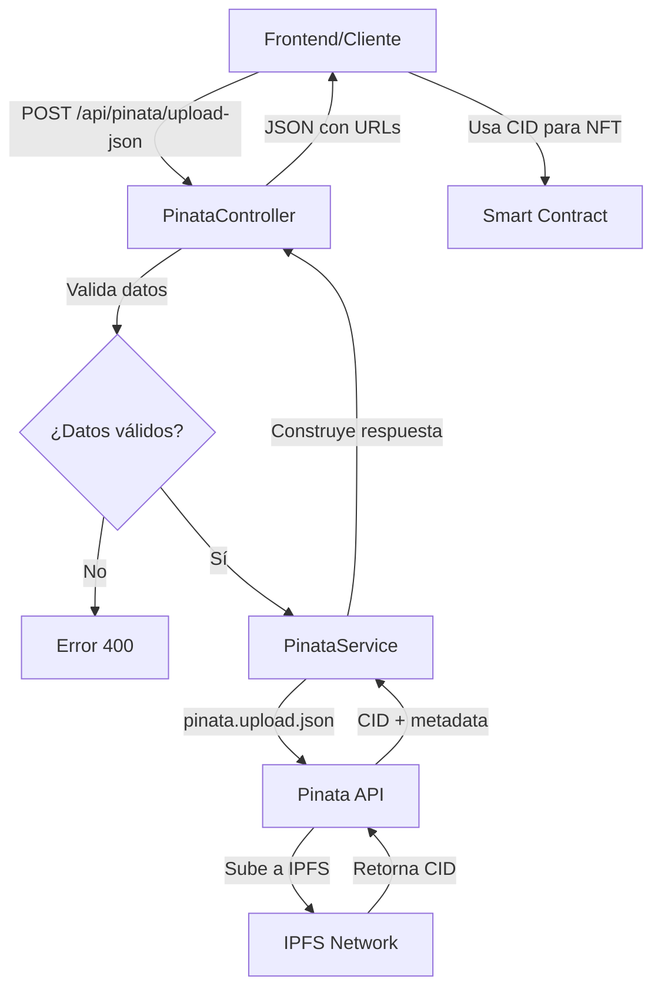

# 📦 Integración de Pinata/IPFS en Backend Reforesta

## 🎯 Descripción

Módulo independiente para subir archivos JSON a IPFS usando Pinata, diseñado específicamente para almacenar metadata de NFTs y datos inmutables en el proyecto Reforesta.

---

## 📁 Estructura del Módulo

```
src/pinata/
├── pinata.controller.ts      # Controlador con endpoints HTTP
├── pinata.service.ts          # Lógica de negocio e integración con Pinata SDK
├── pinata.module.ts           # Módulo de NestJS
└── dto/
    └── upload-json.dto.ts     # DTOs para validación de datos
```

---

## 🔧 Instalación

### 1. Instalar Dependencias

```bash
npm install pinata@^2.5.2 dotenv@^16.4.7
```

### 2. Configurar Variables de Entorno

Crea un archivo `.env` en la raíz del proyecto con las siguientes variables:

```env
# Pinata Configuration
PINATA_JWT=tu_jwt_token_aqui
GATEWAY_URL=gateway.pinata.cloud

# Otras configuraciones existentes...
PORT=3000
```

#### ¿Cómo obtener el PINATA_JWT?

1. Ve a [https://app.pinata.cloud](https://app.pinata.cloud)
2. Crea una cuenta o inicia sesión
3. Ve a **Developers** → **API Keys**
4. Clic en **New Key**
5. Selecciona los permisos:
   - ✅ **pinFileToIPFS**
   - ✅ **pinJSONToIPFS**
6. Dale un nombre (ej: "Reforesta Backend")
7. Copia el **JWT** generado y pégalo en tu `.env`

### 3. Reiniciar el Servidor

```bash
# Modo desarrollo
npm run start:dev

# Modo producción
npm run build
npm run start:prod
```

---

## 🚀 Uso del Endpoint

### **Endpoint Principal**

```
POST http://localhost:3000/api/pinata/upload-json
```

> **Nota:** El prefijo `/api` está configurado globalmente en el proyecto.

---

## 📝 Ejemplos de Uso

### **1. Usando Postman**

#### Configuración:
- **Método:** POST
- **URL:** `http://localhost:3000/api/pinata/upload-json`
- **Headers:**
  ```
  Content-Type: application/json
  ```

#### Body (raw - JSON):
```json
{
  "data": {
    "nombre": "Árbol Nativo #001",
    "descripcion": "Recolección de semillas de especie nativa",
    "especie": "Quercus humboldtii",
    "ubicacion": {
      "latitud": 4.6097,
      "longitud": -74.0817,
      "municipio": "Bogotá"
    },
    "fecha": "2026-01-09",
    "atributos": [
      {
        "tipo": "altura",
        "valor": "15 metros"
      },
      {
        "tipo": "edad_estimada",
        "valor": "50 años"
      }
    ]
  },
  "filename": "recoleccion-001.json"
}
```

#### Respuesta Exitosa (200):
```json
{
  "success": true,
  "cid": "bafkreidrjxlorjhatgeafcojozeiiltrfkzyujcs5w7bxuo2cnibomnd1",
  "name": "recoleccion-001.json",
  "size": 345,
  "ipfs_url": "ipfs://bafkreidrjxlorjhatgeafcojozeiiltrfkzyujcs5w7bxuo2cnibomnd1",
  "gateway_url": "https://gateway.pinata.cloud/ipfs/bafkreidrjxlorjhatgeafcojozeiiltrfkzyujcs5w7bxuo2cnibomnd1",
  "public_url": "https://ipfs.io/ipfs/bafkreidrjxlorjhatgeafcojozeiiltrfkzyujcs5w7bxuo2cnibomnd1",
  "access": "PUBLIC",
  "message": "JSON subido exitosamente a IPFS (acceso público para NFT)",
  "nft_ready": true
}
```

---

### **2. Usando cURL**

```bash
curl -X POST http://localhost:3000/api/pinata/upload-json \
  -H "Content-Type: application/json" \
  -d '{
    "data": {
      "nombre": "Árbol Nativo #001",
      "especie": "Quercus humboldtii"
    },
    "filename": "arbol-001.json"
  }'
```

---

### **3. Usando JavaScript/TypeScript (Frontend)**

```typescript
async function uploadJsonToPinata(data: any, filename?: string) {
  try {
    const response = await fetch('http://localhost:3000/api/pinata/upload-json', {
      method: 'POST',
      headers: {
        'Content-Type': 'application/json',
      },
      body: JSON.stringify({
        data: data,
        filename: filename || 'data.json'
      })
    });

    if (!response.ok) {
      throw new Error(`Error: ${response.status}`);
    }

    const result = await response.json();
    console.log('✅ JSON subido a IPFS:', result);
    console.log('🔗 URL pública:', result.public_url);
    console.log('📦 CID:', result.cid);
    
    return result;
  } catch (error) {
    console.error('❌ Error al subir JSON:', error);
    throw error;
  }
}

// Ejemplo de uso
const metadata = {
  nombre: "Recolección 001",
  especie: "Quercus humboldtii",
  fecha: "2026-01-09"
};

uploadJsonToPinata(metadata, "recoleccion-001.json");
```

---

### **4. Usando Axios**

```typescript
import axios from 'axios';

async function uploadToIPFS(jsonData: any, filename: string = 'data.json') {
  try {
    const response = await axios.post(
      'http://localhost:3000/api/pinata/upload-json',
      {
        data: jsonData,
        filename: filename
      },
      {
        headers: {
          'Content-Type': 'application/json'
        }
      }
    );

    console.log('✅ Subida exitosa:', response.data);
    return response.data;
  } catch (error) {
    console.error('❌ Error:', error.response?.data || error.message);
    throw error;
  }
}
```

---

## 📊 Casos de Uso Específicos para Reforesta

### **1. Metadata de NFT de Recolección**

```json
{
  "data": {
    "name": "Reforesta NFT #001",
    "description": "Certificado de recolección de semillas nativas",
    "image": "ipfs://bafybeihdwdcefgh4dqkjv67uzcmw7ojee6xedzdetojuzjevtenxquvyku",
    "external_url": "https://reforesta.com/nft/001",
    "attributes": [
      {
        "trait_type": "Especie",
        "value": "Quercus humboldtii"
      },
      {
        "trait_type": "Ubicación",
        "value": "Bogotá, Colombia"
      },
      {
        "trait_type": "Fecha de Recolección",
        "value": "2026-01-09"
      },
      {
        "trait_type": "Cantidad de Semillas",
        "value": "500"
      },
      {
        "trait_type": "Estado",
        "value": "Verificado"
      }
    ],
    "recolector": {
      "nombre": "Juan Pérez",
      "cedula": "1234567890"
    },
    "vivero": {
      "nombre": "Vivero Municipal",
      "codigo": "VM001"
    }
  },
  "filename": "nft-recoleccion-001.json"
}
```

### **2. Certificado de Vivero**

```json
{
  "data": {
    "vivero_id": "VM001",
    "nombre": "Vivero Municipal Bogotá",
    "certificaciones": ["Orgánico", "ISO 14001"],
    "especies_disponibles": [
      "Quercus humboldtii",
      "Cedrela montana",
      "Weinmannia tomentosa"
    ],
    "ubicacion": {
      "municipio": "Bogotá",
      "departamento": "Cundinamarca",
      "coordenadas": {
        "lat": 4.6097,
        "lng": -74.0817
      }
    },
    "fecha_certificacion": "2026-01-01",
    "valido_hasta": "2027-01-01"
  },
  "filename": "certificado-vivero-VM001.json"
}
```

### **3. Historial de Planta**

```json
{
  "data": {
    "planta_id": "PL-2026-001",
    "especie": "Quercus humboldtii",
    "origen": {
      "tipo": "recoleccion",
      "fecha": "2026-01-09",
      "ubicacion": "Bogotá",
      "recolector": "Juan Pérez"
    },
    "historial": [
      {
        "fecha": "2026-01-09",
        "evento": "Recolección de semillas",
        "cantidad": "500 semillas"
      },
      {
        "fecha": "2026-01-15",
        "evento": "Siembra en vivero",
        "vivero": "VM001"
      },
      {
        "fecha": "2026-03-20",
        "evento": "Germinación exitosa",
        "tasa": "85%"
      }
    ],
    "metadata_ipfs": "ipfs://bafkreidrjxlor..."
  },
  "filename": "historial-planta-001.json"
}
```

---

## 📥 Respuestas del Endpoint

### **Respuesta Exitosa (200 OK)**

```json
{
  "success": true,
  "cid": "bafkreidrjxlor...",
  "name": "archivo.json",
  "size": 345,
  "ipfs_url": "ipfs://bafkreidrjxlor...",
  "gateway_url": "https://gateway.pinata.cloud/ipfs/bafkreidrjxlor...",
  "public_url": "https://ipfs.io/ipfs/bafkreidrjxlor...",
  "access": "PUBLIC",
  "message": "JSON subido exitosamente a IPFS (acceso público para NFT)",
  "nft_ready": true
}
```

### **Error 400 - Bad Request**

```json
{
  "statusCode": 400,
  "message": "Se requiere el campo \"data\" en el body"
}
```

### **Error 500 - Internal Server Error**

```json
{
  "statusCode": 500,
  "message": "Error al subir JSON a Pinata: [detalle del error]"
}
```

---

## 🔍 Verificar que el Archivo se Subió Correctamente

Una vez que obtengas el `cid` en la respuesta, puedes acceder al archivo de 3 formas:

### **1. Gateway de Pinata (Más Rápido)**
```
https://gateway.pinata.cloud/ipfs/{CID}
```

### **2. Gateway Público de IPFS**
```
https://ipfs.io/ipfs/{CID}
```

### **3. Protocolo IPFS Nativo**
```
ipfs://{CID}
```

Reemplaza `{CID}` con el valor que obtuviste en la respuesta.

---

## 🛠️ Troubleshooting

### **Error: PINATA_JWT no está configurado**
**Solución:** Verifica que el archivo `.env` existe y contiene la variable `PINATA_JWT`.

### **Error 401: Invalid JWT**
**Solución:** 
1. Genera un nuevo JWT en [Pinata Dashboard](https://app.pinata.cloud/developers/api-keys)
2. Asegúrate de copiar el JWT completo (empieza con `eyJ...`)
3. Actualiza el `.env` y reinicia el servidor

### **Error: Cannot connect to Pinata**
**Solución:** 
1. Verifica tu conexión a internet
2. Comprueba que el JWT sea válido y tenga permisos de escritura
3. Revisa que `GATEWAY_URL=gateway.pinata.cloud` (sin `https://`)

### **El endpoint devuelve 404**
**Solución:** 
- Asegúrate de usar la ruta completa: `http://localhost:3000/api/pinata/upload-json`
- Verifica que el servidor esté corriendo con `npm run start:dev`

### **Postman no funciona pero cURL sí**
**Solución:**
1. En Postman, ve a Body → raw
2. Selecciona "JSON" en el dropdown (no "Text")
3. Verifica que el header `Content-Type: application/json` esté presente

---

## 🔐 Seguridad

- ✅ Los archivos subidos son **públicos** por diseño (necesario para NFTs)
- ✅ El JWT de Pinata **nunca** se expone al cliente
- ✅ Solo el backend tiene acceso a las credenciales
- ⚠️ **NO** incluyas datos sensibles en los JSON subidos (no emails, no contraseñas, no datos personales privados)

---

## 📚 Referencias

- **Pinata SDK:** [https://docs.pinata.cloud/sdk](https://docs.pinata.cloud/sdk)
- **IPFS Docs:** [https://docs.ipfs.tech](https://docs.ipfs.tech)
- **NestJS Docs:** [https://docs.nestjs.com](https://docs.nestjs.com)
- **NFT Metadata Standards:** [https://docs.opensea.io/docs/metadata-standards](https://docs.opensea.io/docs/metadata-standards)

---

## ✅ Checklist de Implementación

- [x] Crear estructura de carpetas `src/pinata/`
- [x] Implementar `pinata.service.ts` con SDK
- [x] Implementar `pinata.controller.ts` con endpoint POST
- [x] Crear DTO de validación
- [x] Configurar módulo en `app.module.ts`
- [x] Agregar dependencias en `package.json`
- [x] Crear `.env.example` con variables requeridas
- [ ] Configurar tu propio `.env` con credenciales reales
- [ ] Ejecutar `npm install`
- [ ] Reiniciar servidor con `npm run start:dev`
- [ ] Probar endpoint con Postman

---

## 🎯 Flujo Completo de Uso



---

## 💡 Tips para Producción

1. **Rate Limiting:** Considera implementar límite de peticiones por IP
2. **Validación:** Valida el tamaño máximo del JSON (ej: 1MB)
3. **Logging:** Los logs ya están implementados en el servicio
4. **Monitoreo:** Revisa los logs de Pinata en su dashboard
5. **Backup:** Guarda los CID generados en tu base de datos
6. **Caché:** Los archivos en IPFS son inmutables (puedes cachearlos)

---

**Versión:** 1.0  
**Fecha:** 9 de enero de 2026  
**Proyecto:** Reforesta Backend  
**Autor:** Integración Pinata/IPFS
