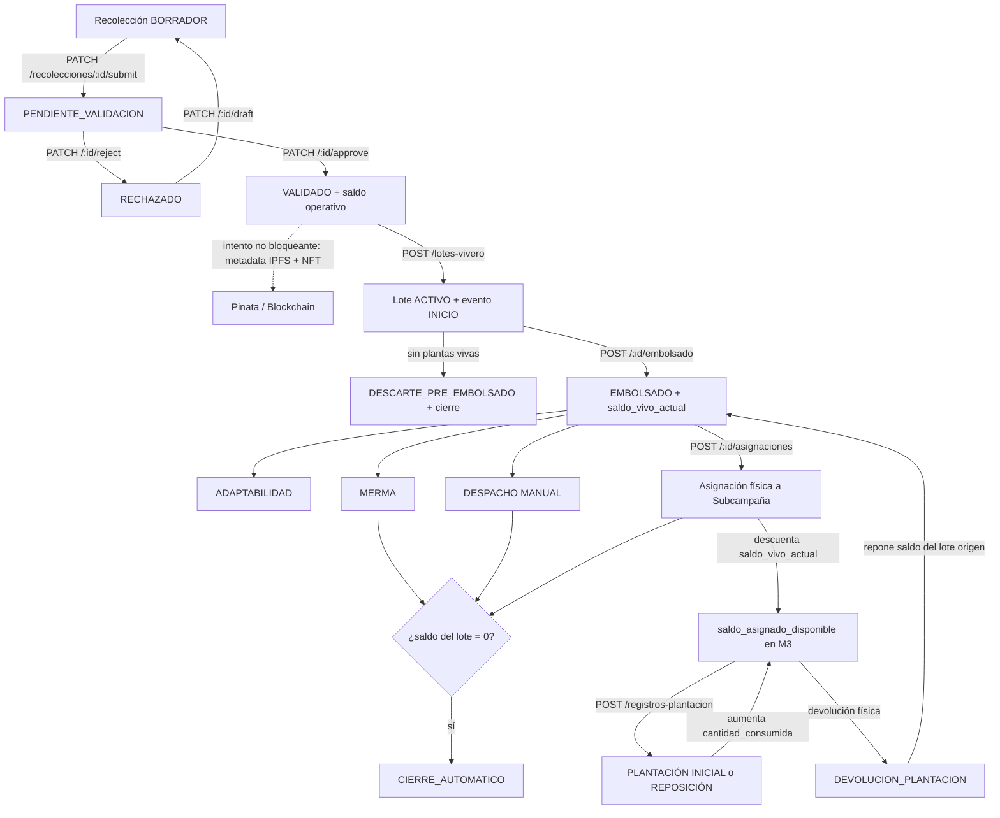

# Flujo end-to-end de trazabilidad

Este documento resume el camino vigente desde la Recolección hasta la
Plantación. La asignación a Subcampaña es una **entrega física**: descuenta
Vivero al asignar y M3 consume luego ese stock sin volver a descontar el lote.



## 1. M1 — Recolección

| Operación | Efecto |
|---|---|
| `POST /api/recolecciones` | Crea `BORRADOR` con fotos multipart |
| `PATCH /api/recolecciones/:id/draft` | Edita `BORRADOR`; si estaba `RECHAZADO`, vuelve a `BORRADOR` |
| `PATCH /api/recolecciones/:id/submit` | Pasa a `PENDIENTE_VALIDACION` |
| `PATCH /api/recolecciones/:id/approve` | Pasa a `VALIDADO`, materializa snapshots e intenta el anclaje |
| `PATCH /api/recolecciones/:id/reject` | Pasa a `RECHAZADO` con motivo |

Una Recolección `VALIDADO` con saldo disponible alimenta Vivero. El historial
de estado y los movimientos de saldo son entidades separadas.

El anclaje externo ocurre después de persistir la validación. Si Pinata o
blockchain fallan, la Recolección permanece validada y el error se registra; no
hay reintento durable automático.

## 2. M2 — Vivero

### Inicio

1. `POST /api/lotes-vivero/evidencias-pendientes`.
2. `POST /api/lotes-vivero`.

La RPC crea el lote, registra `INICIO`, vincula evidencia y consume saldo de
Recolección en una transacción. `INICIO` conserva material en proceso; aún no
existe saldo vivo.

### Nacimiento y pérdida del saldo

- `POST /:id/embolsado`: registra `EMBOLSADO` y crea
  `saldo_vivo_actual`.
- `POST /:id/descarte-pre-embolsado`: cierre total antes de que exista saldo
  vivo.
- `POST /:id/merma`: descuenta plantas que siguen físicamente en Vivero.
- `POST /:id/adaptabilidad`: seguimiento, sin cambio de saldo.

### Dos salidas diferentes

**Despacho manual**

```text
POST /api/lotes-vivero/:id/despacho
```

Registra una salida ajena a una Subcampaña M3. Rechaza
`PLANTACION_CAMPANIA`, exige evidencia y descuenta el saldo físico.

**Asignación física**

```text
POST /api/lotes-vivero/:id/asignaciones
```

Entrega plantas a una Subcampaña. En la misma transacción:

- crea `ASIGNACION_VIVERO_SUBCAMPANIA`;
- registra `DESPACHO / ASIGNACION_SUBCAMPANIA` en M2;
- descuenta `lote_vivero.saldo_vivo_actual`;
- registra `ASIGNACION_VIVERO` en el timeline M3;
- vincula evidencia de la entrega.

## 3. M3 — Plantación

La jerarquía es:

```text
Organización ↔ Campaña → Subcampaña → Registro de plantación
```

La Subcampaña define polígono, metas por especie, equipo y ciclo de vida. Las
asignaciones solo se crean cuando el estado y el propósito lo permiten:

- `PLANTACION_INICIAL`: Subcampaña `ACTIVA`;
- `REPOSICION`: `ACTIVA`, `COMPLETADA` o `FINALIZADA_PARCIAL`.

`POST /api/registros-plantacion` llama
`fn_m3_registrar_plantacion`. La RPC:

- valida estado, propósito, GPS, detalle y stock;
- crea registro y detalles;
- aumenta `cantidad_consumida`;
- vincula evidencia;
- no crea `EVENTO_LOTE_VIVERO`;
- no modifica `lote_vivero.saldo_vivo_actual`.

## 4. Conservación de stock

```text
saldo_asignado_disponible
= cantidad_asignada
- cantidad_consumida
- cantidad_devuelta
- cantidad_mermada
```

- `cantidad_asignada` no se edita.
- Plantación/reposición aumenta `cantidad_consumida`.
- Devolución aumenta `cantidad_devuelta` y repone el lote.
- La merma de stock ya entregado pertenece a M3; el flujo operativo permanece
  fuera del MVP actual.

## 5. Persistencia e integraciones

| Componente | Función |
|---|---|
| PostgreSQL/Supabase | Fuente de verdad, estados, saldos, snapshots e historiales |
| RPC PostgreSQL | Transacciones de dominio y control de concurrencia |
| Supabase Storage | Binarios de evidencia |
| Pinata/IPFS | JSON de metadata NFT de Recolección |
| Blockchain | Anclaje complementario de Recolección validada |
| PostGIS | Polígonos y validación GPS de Plantación |

## 6. Límites actuales

- El JWT no se valida globalmente; muchos endpoints confían en `x-auth-id`.
- Pinata/blockchain no usan outbox ni reintento durable.
- Challenges WebAuthn viven en memoria.
- La reaplicación de migraciones no reproduce todavía dos cambios directos del
  esquema vivo: tipo de planta y enum de destino de Vivero.

Ver riesgos y prioridades en [ARCHITECTURE.md](../../ARCHITECTURE.md).
