## Documentación actualizada (Mermaid ER)

```mermaid
erDiagram
    %% =====================================================
    %% R3Foresta - BD Oficial (Supabase / Postgres)
    %% vActual: Ubicaciones por Divisiones Administrativas
    %% =====================================================

    USUARIO {
        bigint id PK
        string nombre
        string apellido "max 30 chars"
        string username "UNIQUE; default ''"
        string correo "UNIQUE; default ''"
        string auth_id "default ''"
        string doc_identidad "UNIQUE, opcional"
        string wallet_address "UNIQUE; opcional; formato: 0x + 40 hex"
        string organizacion "texto"
        string contacto "opcional; formato: +########"
        string rol "DEFAULT=GENERAL; (enum rol_usuario)"
        datetime created_at
    }

    USUARIO_CREDENCIAL {
        bigint id PK
        bigint usuario_id FK
        string credential_id "UNIQUE"
        string public_key
        string algorithm "DEFAULT=ES256"
        int counter "DEFAULT=0"
        string[] transports "ARRAY"
        datetime created_at
        datetime last_used_at
    }

    %% ==============================
    %% UBICACIONES (nuevo modelo)
    %% ==============================

    PAIS {
        bigint id PK
        string nombre
        string codigo_iso2 "UNIQUE"
        string codigo_iso3 "opcional"
        bool activo "DEFAULT=true"
        datetime created_at
    }

    DIVISION_TIPO {
        bigint id PK
        bigint pais_id FK
        string nombre "Ej: Departamento, Provincia, Estado, Cantón..."
        int orden "1..n dentro del país"
        bool activo "DEFAULT=true"
        datetime created_at
    }

    DIVISION_ADMINISTRATIVA {
        bigint id PK
        bigint pais_id FK
        bigint parent_id FK "auto-referencia (árbol)"
        bigint tipo_id FK
        string nombre
        string codigo_externo "opcional (INE/ISO/local)"
        bool activo "DEFAULT=true"
        bigint reemplazada_por_id FK "opcional; soft-merge"
        datetime created_at
        datetime updated_at
    }

    UBICACION {
        bigint id PK
        decimal latitud "CHECK [-90..90]"
        decimal longitud "CHECK [-180..180]"
        bigint pais_id FK "opcional (fallback / filtros rápidos)"
        bigint division_id FK "opcional: división más específica conocida"
        string nombre "Ej: Parcela Don Lucho / Vivero Central"
        int precision_m "opcional; >0"
        string fuente "GPS_MOVIL | MAPA | MANUAL | LEGACY"
        string referencia "texto libre (indicaciones / extra)"
        datetime created_at
        datetime updated_at
    }

    VIVERO {
        bigint id PK
        string codigo "UNIQUE"
        string nombre "(enum o user-defined en DB)"
        bigint ubicacion_id FK "UNIQUE (1:1 con UBICACION)"
        datetime created_at
    }

    %% ==============================
    %% Catálogos
    %% ==============================

    TIPO_PLANTA {
        int id PK
        string nombre "UNIQUE"
        datetime created_at
    }

    PLANTA {
        bigint id PK
        string especie
        string nombre_cientifico
        string variedad
        int tipo_planta_id FK
        string nombre_comun_principal
        string nombres_comunes
        string imagen_url
        string notas
        datetime created_at
    }

    METODO_RECOLECCION {
        bigint id PK
        string nombre "(enum/user-defined; UNIQUE)"
        string descripcion
    }

    TIPO_RIEGO {
        int id PK
        string nombre "UNIQUE"
        string descripcion
    }

    TIPO_ABONO {
        int id PK
        string nombre "UNIQUE"
        string descripcion
    }

    %% ==============================
    %% Recolección
    %% ==============================

    RECOLECCION {
        bigint id PK
        date fecha "CHECK [hoy-45d .. hoy]"
        string nombre_cientifico "si no hay planta_id"
        string nombre_comercial "si no hay planta_id"
        decimal cantidad "OBLIGATORIO > 0"
        string unidad "texto (regla en backend/enum futuro)"
        string tipo_material "(enum estado_recoleccion / tipo_material user-defined)"
        string estado "DEFAULT=ALMACENADO (enum estado_recoleccion)"
        bool especie_nueva "DEFAULT=false"
        string observaciones "max 1000 chars"
        bigint usuario_id FK
        bigint ubicacion_id FK
        bigint vivero_id FK "opcional"
        bigint metodo_id FK
        bigint planta_id FK "opcional"
        datetime created_at
        string codigo_trazabilidad "UNIQUE"
        string blockchain_url "opcional"
        string token_id "opcional"
        string transaction_hash "opcional"
    }

    RECOLECCION_FOTO {
        bigint id PK
        bigint recoleccion_id FK
        string url
        int peso_bytes "max 5MB"
        string formato "JPG/JPEG/PNG"
        datetime created_at
    }

    %% ==============================
    %% Fase Vivero
    %% ==============================

    LOTE_FASE_VIVERO {
        bigint id PK
        bigint planta_id FK
        bigint vivero_id FK
        bigint responsable_id FK
        date fecha_inicio
        int cantidad_inicio
        int cantidad_embolsadas "DEFAULT=0"
        int cantidad_sombra "DEFAULT=0"
        int cantidad_lista_plantar "DEFAULT=0"
        date fecha_embolsado
        date fecha_sombra
        date fecha_salida
        decimal altura_prom_sombra
        decimal altura_prom_salida
        string estado "DEFAULT=INICIO (enum lote_estado)"
        datetime created_at
        datetime updated_at
        bigint updated_by FK "opcional; recomendado en update"
        string codigo_trazabilidad "UNIQUE"
    }

    LOTE_FASE_VIVERO_HISTORIAL {
        bigint id PK
        bigint lote_id FK
        int nro_cambio
        datetime fecha_cambio "DEFAULT=now()"
        bigint responsable_id FK
        string accion "(enum user-defined)"
        string estado "(enum user-defined)"
        int cantidad_inicio
        int cantidad_embolsadas
        int cantidad_sombra
        int cantidad_lista_plantar
        date fecha_inicio
        date fecha_embolsado
        date fecha_sombra
        date fecha_salida
        decimal altura_prom_sombra
        decimal altura_prom_salida
        string notas "max 2000 chars"
    }

    LOTE_FASE_VIVERO_FOTO {
        bigint id PK
        bigint lote_historial_id FK
        string url
        int peso_bytes
        string formato
        bool es_portada
        string descripcion
        datetime created_at
    }

    LOTE_FASE_VIVERO_RECOLECCION {
        bigint lote_id PK, FK
        bigint recoleccion_id PK, FK
    }

    %% ==============================
    %% Plantación
    %% ==============================

    PLANTACION {
        bigint id PK
        string codigo_trazabilidad "UNIQUE"
        string destino "CHECK: ARBORIZACION|FORESTACION|REFORESTACION"
        int ubicacion_id FK
        int cantidad_arboles "OBLIGATORIO > 0"
        date fecha_plantacion "OBLIGATORIO"
        decimal superficie_m2
        decimal tamano_promedio_cm
        string propietario
        string origen_propiedad "DONADO|ADQUIRIDO|OTRO|NULL"
        int frecuencia_monitoreo_dias
        int created_by FK
        datetime created_at
    }

    PLANTACION_USUARIO {
        bigint plantacion_id PK, FK
        int usuario_id PK, FK
        string rol "opcional"
    }

    PLANTACION_LOTE_FASE_VIVERO {
        bigint plantacion_id PK, FK
        int lote_fase_vivero_id PK, FK
        int cantidad_plantines_usados "OBLIGATORIO > 0"
    }

    PLANTACION_RIEGO {
        bigint plantacion_id PK, FK
        int tipo_riego_id PK, FK
    }

    PLANTACION_ABONO {
        bigint plantacion_id PK, FK
        int tipo_abono_id PK, FK
    }

    PLANTACION_FOTO {
        bigint id PK
        bigint plantacion_id FK
        string url
        int peso_bytes
        string formato
        string descripcion
    }

    PLANTACION_MONITOREO {
        bigint id PK
        bigint plantacion_id FK
        date fecha_monitoreo
        int arboles_vivos
        int arboles_muertos
        int arboles_reemplazados
        string notas
        int usuario_id FK
        datetime created_at
    }

    %% =====================================================
    %% Relaciones
    %% =====================================================

    USUARIO ||--o{ USUARIO_CREDENCIAL : tiene

    PAIS ||--o{ DIVISION_TIPO : define
    PAIS ||--o{ DIVISION_ADMINISTRATIVA : contiene
    DIVISION_TIPO ||--o{ DIVISION_ADMINISTRATIVA : clasifica
    DIVISION_ADMINISTRATIVA ||--o{ DIVISION_ADMINISTRATIVA : contiene "parent_id"
    DIVISION_ADMINISTRATIVA ||--o| DIVISION_ADMINISTRATIVA : reemplaza "reemplazada_por_id"

    PAIS ||--o{ UBICACION : agrupa "opcional via pais_id"
    DIVISION_ADMINISTRATIVA ||--o{ UBICACION : ubica "opcional via division_id"

    UBICACION ||--o{ VIVERO : tiene
    UBICACION ||--o{ RECOLECCION : ocurre_en
    UBICACION ||--o{ PLANTACION : se_ubica_en

    USUARIO ||--o{ RECOLECCION : recolecta
    USUARIO ||--o{ LOTE_FASE_VIVERO : crea
    USUARIO ||--o{ LOTE_FASE_VIVERO_HISTORIAL : registra
    USUARIO ||--o{ PLANTACION : registra
    USUARIO ||--o{ PLANTACION_USUARIO : participa
    USUARIO ||--o{ PLANTACION_MONITOREO : monitorea

    VIVERO ||--o{ RECOLECCION : almacena
    VIVERO ||--o{ LOTE_FASE_VIVERO : se_realiza_en

    PLANTA ||--o{ RECOLECCION : corresponde_a
    PLANTA ||--o{ LOTE_FASE_VIVERO : se_siembra

    METODO_RECOLECCION ||--o{ RECOLECCION : se_usa_en
    RECOLECCION ||--o{ RECOLECCION_FOTO : tiene

    LOTE_FASE_VIVERO ||--o{ LOTE_FASE_VIVERO_RECOLECCION : usa
    RECOLECCION ||--o{ LOTE_FASE_VIVERO_RECOLECCION : proviene_de
    LOTE_FASE_VIVERO ||--o{ LOTE_FASE_VIVERO_HISTORIAL : versiona
    LOTE_FASE_VIVERO_HISTORIAL ||--o{ LOTE_FASE_VIVERO_FOTO : evidencia

    PLANTACION ||--o{ PLANTACION_USUARIO : tiene
    PLANTACION ||--o{ PLANTACION_LOTE_FASE_VIVERO : usa_lotes_vivero
    LOTE_FASE_VIVERO ||--o{ PLANTACION_LOTE_FASE_VIVERO : provee_plantines

    PLANTACION ||--o{ PLANTACION_RIEGO : usa_riego
    TIPO_RIEGO ||--o{ PLANTACION_RIEGO : se_aplica_en

    PLANTACION ||--o{ PLANTACION_ABONO : usa_abono
    TIPO_ABONO ||--o{ PLANTACION_ABONO : se_aplica_en

    PLANTACION ||--o{ PLANTACION_FOTO : tiene
    PLANTACION ||--o{ PLANTACION_MONITOREO : tiene_monitoreos
```

---

## Aclaraciones (déjalas aparte tal como pediste)

**En UBICACION (nuevo):**

* `division_id` = la **división más específica** conocida (puede ser municipio, comunidad, cantón, etc.)
* `nombre` = nombre del sitio puntual: *Parcela X, Vivero Y, Sector Z*
* `fuente` = `GPS_MOVIL | MAPA | MANUAL | LEGACY`
* `precision_m` = precisión aproximada en metros
* `referencia` = indicaciones humanas (texto libre)

**En DIVISION_ADMINISTRATIVA:**

* `parent_id` arma el árbol (nivel variable por país)
* `reemplazada_por_id` sirve para “fusionar/renombrar” sin borrar historia (muy útil para trazabilidad)

**En RECOLECCION:**

* `estado` = `ALMACENADO` por defecto (enum)
* `tipo_material` = enum user-defined
* fechas: `fecha` limitada a 45 días hacia atrás

**En LOTE_FASE_VIVERO:**

* `estado` = enum `lote_estado`
* `updated_at` y `updated_by` se usan para auditoría y para el historial

**En PLANTACION:**

* `destino` = `ARBORIZACION | FORESTACION | REFORESTACION`
* `origen_propiedad` = `DONADO | ADQUIRIDO | OTRO | NULL`

